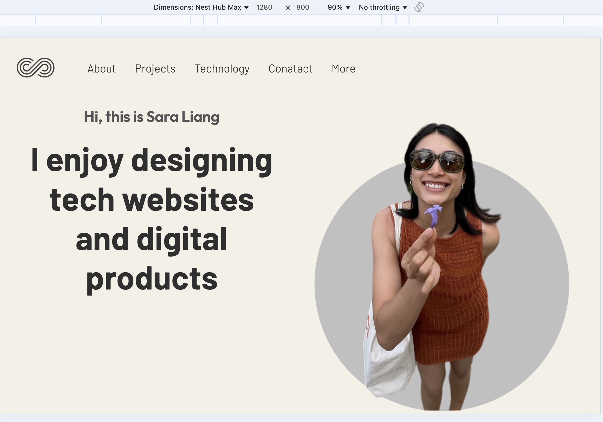
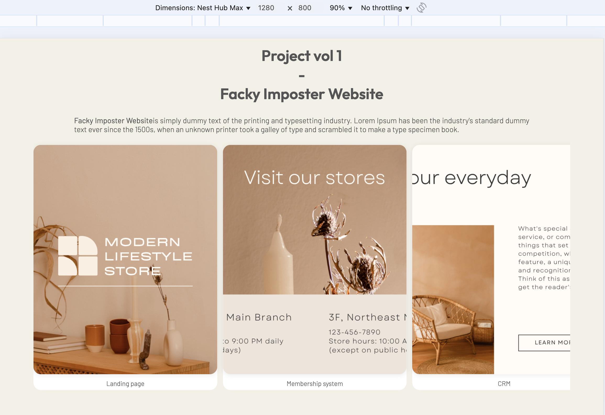
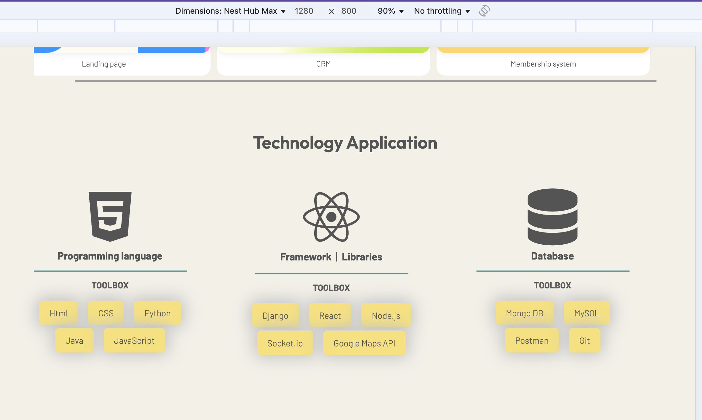
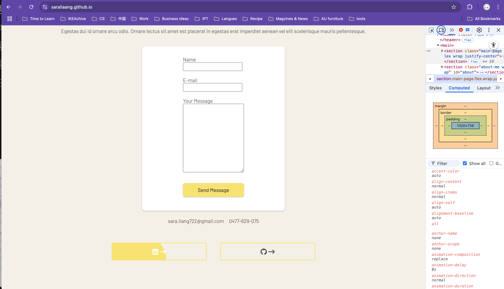
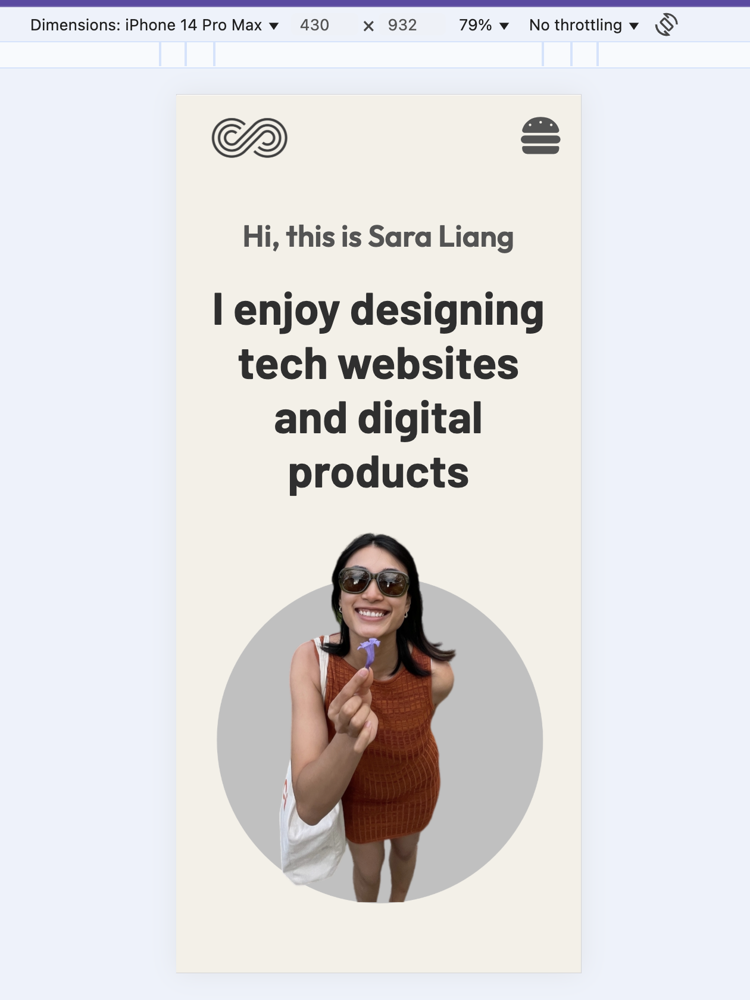
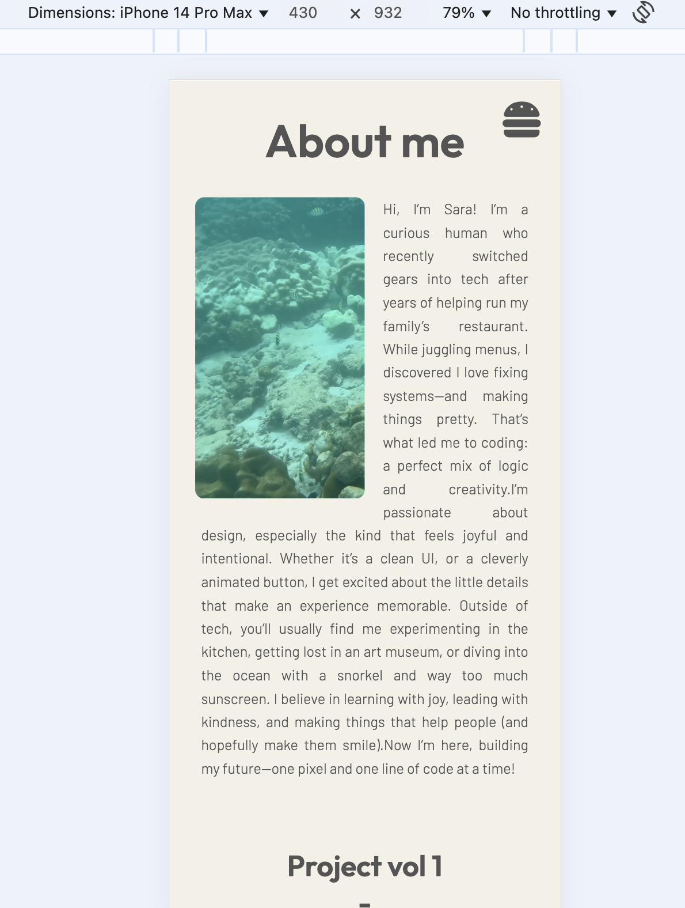
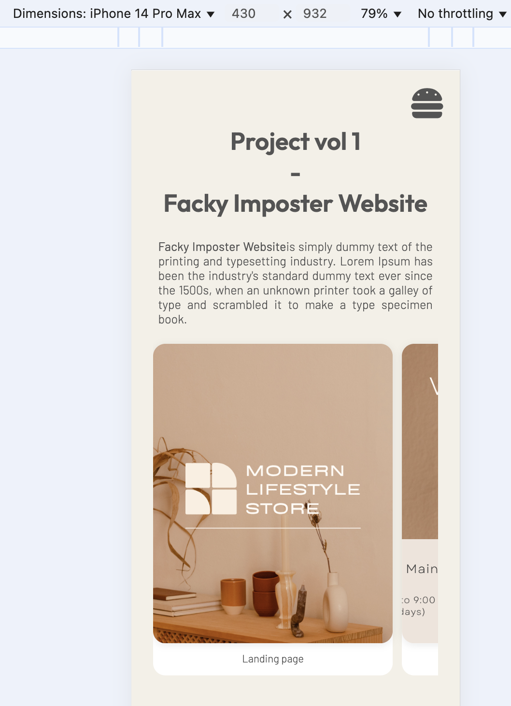
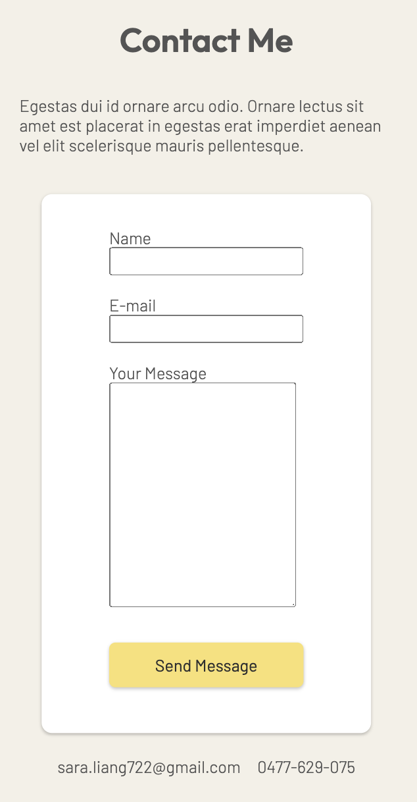

#  Sara Liang - Portfolio Task
​
[My portfolio site](https://saraliaang.github.io/)
​
## Project Requirements

### Content

The portfolio is a two-page, responsive site designed to be clean and accessible. It includes:

#### 🏠 Home Page (`index.html`)

The homepage includes a profile photo and a personal biography that introduces who I am, what I'm passionate about, and my motivations for becoming a developer. The contact section uses a `mailto:` link to allow direct communication. The "Projects" section highlights two sample projects with brief descriptions with the design of sleek thread-kike carosal diplaying the screenshot(fake, to be added in the future) External links to my GitHub and LinkedIn profiles are clearly accessible with hover on background-color transition, giving visitors an easy way to learn more about my work and connect.

#### 📁 Projects Page (`more.html`)
- Two placeholder projects
- Each includes a title, description, and button

#### 🌐 Sitewide Design & Structure
- Clean, minimalist aesthetic with soft colors
- Responsive design for mobile, tablet, and desktop
- Semantic HTML: `<header>`, `<section>`, `<footer>`, etc.
- Hover and focus states on interactive elements

​
### Technical

This project follows best practices for static website development, with a focus on structure, responsiveness, and accessibility:

#### 📄 Page Structure
- Two HTML pages:
  - `index.html` – Home page
  - `more.html` – Projects page

#### 🔧 Development Workflow
- Version controlled using **Git**
- Hosted and deployed via **GitHub Pages**  
  → [https://saraliaang.github.io/](https://saraliaang.github.io/)

#### 📱 Responsive Design
- Media queries used to ensure the layout adapts seamlessly across:
  - Desktop
  - Tablet
  - Mobile
- Elements are not just resized — their **layout and positioning are restructured** to maintain clarity and visual balance at different screen sizes
- Implemented thoughtful visual reorganization to support **natural reading flow** and improve aesthetic appeal
- Responsive navigation with:
  - A **horizontal navigation bar** on desktop
  - A classic **hamburger menu** on smaller screens

#### 🎬 Media and Interaction Features
- Embedded a **video element** using CSS `float`, with autoplay and muted playback enabled for smooth integration into the layout
- Hover and focus styles applied to interactive elements to enhance user experience and accessibility

#### 🧱 Semantic HTML
- Structured using semantic tags:
  - `<header>`, `<nav>`, `<section>`, `<article>`, `<footer>`

### Bonus (optional)

I didn’t use any JavaScript in this project, but I focused on adding small CSS touches to make the site feel more interactive.  
- I added different styles for hover and focus states on buttons and links so users get visual feedback as they move through the site.
- The navigation is responsive: on smaller screens, it turns into a hamburger menu that stacks vertically; on larger screens, it switches to a horizontal layout with links spaced out in a row. All of this was done using just HTML and CSS.

### Screenshots
#### Homepage – Desktop View

#### Project – Desktop View

#### tech – Desktop View

#### Form – Desktop View

#### Projects Page – Mobile View

#### Bio Page – Mobile View

#### Projects Page – Mobile View

#### Form Page – Mobile View
